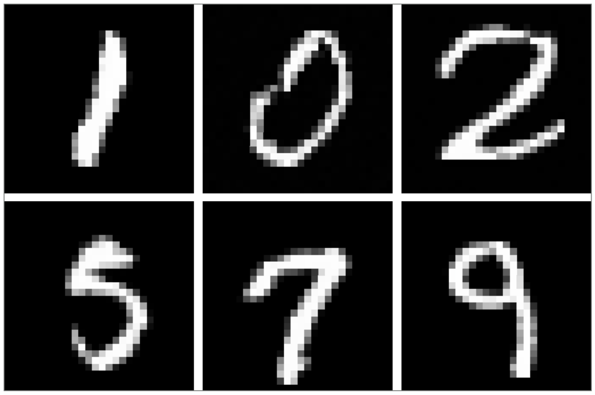

# Flow Matching Playground

## Installation 

Make sure you have [uv](https://docs.astral.sh/uv/getting-started/installation/) installed, then run

```bash
uv venv --python 3.13
source .venv/bin/activate
```

then run the following. It will install all the dependencies listed in the `pyproject.toml` file

```bash
uv pip install -e .
```

## Committing to this repo
Make sure to install [pre-commit](https://pre-commit.com) before committing to this repo by running

```bash
pre-commit install
```

## Train the flow matching on the MNIST data
You can train the flow model with the following 

```bash
python src/__main__ experiment.mode=training
```

While it is running, you can investigate the advance thanks to TensorBoard with 
```bash 
tensorboard --logdir runs/experiment_<date_of_the_run>
```

## Samples

Here are some samples generated during the training.


